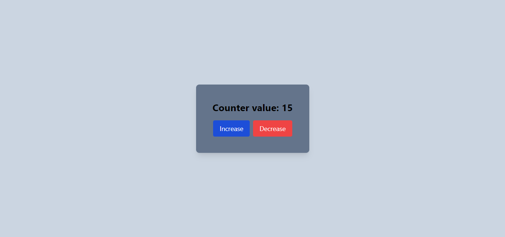

# React Counter Project

This is a simple React project that demonstrates the use of the `useState` hook for state management and Tailwind CSS for styling. It implements a counter with increment and decrement functionality within a specified range.

## Key Concepts

- **React:** This project utilizes React, a popular JavaScript library for building user interfaces. It leverages the `useState` hook to manage the counter's value.
- **useState Hook:** The `useState` hook is a built-in React function that allows components to track and update state values. In this project, `useState` manages the current counter value.
- **tailwind CSS:** Tailwind CSS is a utility-first CSS framework that provides low-level utility classes for rapid UI development. This project uses Tailwind for styling the counter UI.

## Functionality

- The counter allows you to increment its value up to a predefined upper limit.
- You can also decrement the counter down to a set lower limit.
- Tailwind CSS provides a sleek and responsive design that adapts to different screen sizes.


## Demo



## Installation

To get a local copy up and running follow these simple steps:

1. **Clone the repository:**

```bash
git clone https://github.com/adarsh-2003/React-counter-app.git
cd react-counter
npm install
npm run dev